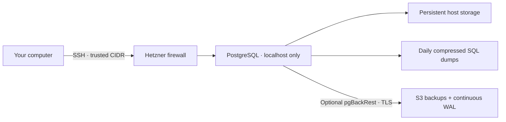

# Automated PostgreSQL on Hetzner

[](https://github.com/s04/automated-hetzner-postgres/actions/workflows/validate.yml)

**One machine. Persistent PostgreSQL. Backups you can restore.**

Terraform provisions a Hetzner Cloud server; Ansible configures PostgreSQL, the firewall, tuning, and backups. A few Make commands handle day-to-day operations. No Kubernetes or cluster to maintain.



| Included | What it does |
| --- | --- |
| Safe reruns | Preserves existing data; refuses incompatible major versions |
| Restricted access | Cloud firewall, localhost database binding, SSH keys, UFW, fail2ban |
| Host-aware tuning | RAM/CPU-based memory and parallelism settings; WAL/checkpoint defaults |
| Local backups | Daily compressed SQL, atomic completion, locking, retention after success |
| Optional Terraform bucket | Creates a private Hetzner bucket, keeps its state separate, and exports backup settings |
| Optional S3 recovery | Initial full backup, weekly full/daily differential backups, WAL archiving, point-in-time recovery |
| Restore drills | Restores into an isolated container, checks recovery, then cleans up |
| Maintenance | Health checks, bounded logs, backup-before-patch upgrades, status command |
| CI | Terraform validation, Ansible lint/syntax, regression tests |

This is a **single Ubuntu 24.04 machine**, not a highly available service. You still own monitoring, capacity, and recovery decisions. S3 must be enabled and configured for off-server recovery.

## Quick start

You need a Hetzner project/API token with read/write access, Terraform >= 1.5, Python 3.11+, Make, and an SSH key. Provisioning and object storage incur provider charges. Run these commands from the repository root.

### 1. Install dependencies

```bash
python3 -m venv .venv
source .venv/bin/activate
pip install -r requirements-dev.txt
ansible-galaxy collection install -r requirements.yml
```

### 2. Set your configuration

```bash
cp terraform/terraform.tfvars.example terraform/terraform.tfvars
cp config.example.yml config.yml
# If you need a key, create one with: ssh-keygen -t ed25519
```

Edit `terraform/terraform.tfvars`: set `allowed_cidr` to **your public IP with `/32`**, and `ssh_public_key_path` to your key. The default is `cx23` in `nbg1`; adjust for your region and capacity. Unrestricted `/0` access is rejected. Load a non-default private key into your SSH agent, or pass `--private-key` through `ANSIBLE_ARGS`.

Set credentials in your environment (Bash):

```bash
read -rsp 'Hetzner token: ' HCLOUD_TOKEN; echo
export HCLOUD_TOKEN
export POSTGRES_DB=mydb
export POSTGRES_USER=myadmin
read -rsp 'Database password (at least 16 characters): ' POSTGRES_PASSWORD; echo
export POSTGRES_PASSWORD
```

`config.yml` holds your PostgreSQL choices. Make commands load it automatically. For off-server backups, export separate Hetzner S3 credentials and run `make bucket`, or use an existing bucket. See [S3 setup](docs/backups.md). Tokens, local configuration, state, and private keys should never be committed; use Ansible Vault for stored secrets.

### 3. Deploy

```bash
make deploy
```

Review Terraform's plan and confirm it. On first SSH connection, verify the server fingerprint through a trusted channel. If the VM is still booting, retry with `make configure`.

The playbook waits for PostgreSQL readiness and, when S3 is enabled, verifies WAL archiving and takes the first full backup. The default PostgreSQL major stays **16** for compatibility; new installations can choose **17 or 18** in `config.yml`.

### 4. Connect

```bash
make tunnel
# In another terminal, using a locally installed PostgreSQL client:
psql -h 127.0.0.1 -p 54321 -U myadmin -d mydb
```

`POSTGRES_USER` is a database superuser. Create limited application roles. Initialization variables do not rotate passwords or rename existing databases on later runs.

## Everyday commands

```bash
make status         # Health, disk usage, WAL archive statistics, backup inventory
make backup         # Compressed local SQL backup
make s3-backup      # Differential backup to configured S3
make restore-drill  # Restore S3 into a disposable database and clean up
make configure     # Reapply config; keeps data
make upgrade       # Back up locally + configured S3, then update the current major's image
```

Image updates can briefly interrupt connections. A normal run reuses cached images; `make upgrade` explicitly pulls/rebuilds. Major upgrades require migration. The restore drill needs enough additional disk space for a restored database and generates S3 traffic.

## Configuration and operating guides

- [S3, WAL, point-in-time recovery, and disaster recovery](docs/backups.md)
- [Tuning and its limits](docs/tuning.md)
- [Local backups, patch/major upgrades, credentials, troubleshooting](docs/operations.md)
- [All Ansible defaults](group_vars/postgres.yml) and [Terraform variables](terraform/variables.tf)
- [Changes and compatibility notes](CHANGELOG.md)
- [Validation results and test boundaries](docs/validation.md)

Use `ANSIBLE_ARGS` for additional Ansible options, e.g. `make configure ANSIBLE_ARGS='--ask-vault-pass -e @secrets.yml'`. Direct Ansible users must pass `-e @config.yml` and, when generated, `-e @backup.generated.yml` themselves. Static inventory remains available in `inventory.ini`. OpenTofu users can use `make TF=tofu`; the inventory also supports `TF_BIN` and `TF_DIR`. Keep one state tool per deployment.

Data is stored at `/var/lib/postgresql/data`; local backups at `/var/backups/postgresql`. Local backups run at 01:00 server time. S3 backups run at 02:00, with full backups on Sundays. Use a unique S3 prefix for each independent cluster.

**Existing users:** make an off-server backup before upgrading this repository and inspect `terraform plan`. Set your existing server type and SSH key path explicitly: defaults changed from `cx22`/RSA to `cx23`/Ed25519. Terraform resource addresses are preserved. The destructive `keep_existing_data` option is gone; old backup files remain untouched. Automatic tuning changes PostgreSQL settings and can restart the container; set `postgres_autotune: false` to opt out.

## Network and durability

Only SSH is opened by the cloud firewall. PostgreSQL binds to `127.0.0.1`; remote traffic travels through the encrypted SSH tunnel. Docker-published ports can bypass UFW, so UFW alone is insufficient. Public database access is deliberately not a configuration switch.

Local dumps share the VM's fate. Enable S3 for disaster recovery and test restores regularly. If S3 becomes unavailable, unarchived WAL accumulates on disk: monitor disk space and archive failures. PostgreSQL durability settings remain enabled. A Docker health check reports health; it does not restart an unhealthy running process.

## Development

```bash
make check
```

CI runs on pushes, pull requests, and a weekly schedule without cloud credentials. Dependabot opens monthly update PRs for GitHub Actions, Python dependencies, and Terraform providers; changes are not automatically merged. See [CONTRIBUTING.md](CONTRIBUTING.md) for live test expectations.

## Cleanup

Ensure required backups are off-server, then review and confirm:

```bash
terraform -chdir=terraform destroy
```

This deletes the VM and its local data. The optional bucket has separate Terraform state and is not destroyed by this command.

## References

[PostgreSQL image](https://hub.docker.com/_/postgres) · [Ansible Docker module](https://docs.ansible.com/projects/ansible/latest/collections/community/docker/docker_container_module.html) · [Hetzner provider](https://registry.terraform.io/providers/hetznercloud/hcloud/latest/docs/resources/server) · [pgBackRest guide](https://pgbackrest.org/user-guide.html)

## License

[MIT](LICENSE) — Copyright (c) 2026 Saul O'Driscoll.
